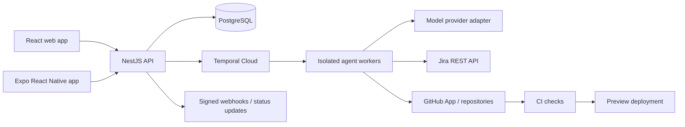

# Agentic Product Studio — product brief

## Refined product direction

**An AI software studio that turns a client’s approved Jira brief into a tested, reviewable app, with a visible team of specialist agents doing the work.** The studio is the company product; each client engagement runs as an isolated project with its own brief, workflow, integrations, repository, artifacts, and release settings.

The product has two connected layers:

- **Studio operations:** create and manage client projects, configure reusable delivery playbooks, connect approved tools, and see delivery health across engagements.
- **Client project room:** follow one project from idea to release, inspect the work and evidence, answer questions, and approve decisions.

The UI should feel lively and game-like through presence, progress, milestones, and satisfying handoffs. It must be a truthful control room: agent “presence” and activity are driven by actual tasks, tool calls, and workflow events. The experience should make the work legible, not imply that agents are doing things they are not doing.

### The delivery loop

1. **Business analyst + product lead** turn the request into a problem statement, target users, constraints, assumptions, and measurable outcomes. They ask the client to resolve missing or conflicting information before scope is treated as ready.
2. **Project manager** shapes the agreed scope into milestones, dependencies, and Jira epics/stories. Jira is the visible delivery queue: each stage updates the relevant issue, and the next stage starts from an explicit Jira status/hand-off.
3. **Figma designer** turns accepted stories into user flows, wireframes, and a design handoff. Figma links and artifacts are attached to the Jira work.
4. **QA analyst** challenges acceptance criteria early, drafts a test plan, and proposes unit, integration, end-to-end, smoke, sanity, and regression coverage. Unclear requirements return to the analyst/product owner with specific questions.
5. **Frontend and backend developers** implement separately scoped work against the accepted design and Jira criteria. They can request clarification or send a failed/blocked item back to its responsible owner.
6. **QA** runs the agreed checks after implementation, records evidence, and routes failures to the relevant developer with reproducible steps. A bounded fix-and-retest loop follows.
7. **Delivery engineer** reviews the assembled change, opens or updates the pull request, monitors CI/CD, and attaches preview and deployment evidence. Production release is an explicit approval by default.

Every handoff has an owner, Jira issue, inputs, output artifact, status, and acceptance check. A failed check or missing decision reopens the right work item rather than advancing the workflow. The PM agent coordinates dependencies; it does not silently overrule the specialist responsible for the work.

### Product principles

- **Jira carries the work forward.** Keep the workflow state synchronized with Jira and make the issue/status behind each handoff visible. The app may keep a local event log and artifact index, but should not create a competing, hidden project state.
- **Make progress feel tangible.** Show a studio floor or team board with specialist agents, active work, blocked items, handoffs, milestones, and recent events. Use subtle animations, badges, and project milestones as motivation; avoid points or streaks that reward speed over quality.
- **Show real work, not staged theater.** Agent avatars, “working” states, progress, and completion derive from persisted task events and tool activity. Label simulated/demo activity clearly.
- **Keep human decisions in the loop.** People can answer questions, edit requirements, accept artifacts, change scope, and approve sensitive actions. They should not need to approve every routine agent handoff.
- **Treat each client project as a boundary.** Separate project data, credentials, repositories, Jira spaces, and deployment targets. Reusable playbooks may be shared by the studio, client data may not.
- **Integrate through scoped connectors.** Prefer Jira, Figma, GitHub, CI/CD, and deployment MCP servers/connectors where available. Keep a provider adapter so an integration can use a direct API when MCP is unavailable or unsuitable.

### First product slice

Start with one studio workspace and one client project room. Demonstrate a seeded but clearly labeled run, then build the real path for a narrow web-app feature:

1. Capture a client request and produce an editable, reviewable brief.
2. Resolve ambiguities and get scope approval.
3. Create Jira work and move it through defined statuses.
4. Produce a wireframe/design handoff (Figma link or a local artifact in demo mode).
5. Draft QA coverage, implement a small frontend/backend change, and run checks.
6. Open a PR and publish a preview deployment with evidence.
7. Show the full activity trail, artifacts, blockers, and human decisions in the interactive project room.

Use a demo connector mode before asking reviewers to provide credentials. The demo should distinguish seeded events from live agent execution and never present a mock deployment as a real release.

### Jira setup discovered during development

- Site: `https://tinoonegithub.atlassian.net/`
- Visible Jira project: `SCRUM` — `TinoDevTeam`
- The current Codex Atlassian connection can access the site. This does not grant the static browser app access; app-side OAuth, credential storage, project selection, and synchronization still need to be implemented.
- Keep the seeded Waypoint project separate from `SCRUM` until the studio owner deliberately selects a real client project. Do not write demo requirements into the user's Jira project.

## Product idea

An AI assisted workspace that takes a business idea through discovery, product definition, design, implementation, QA, project management, and deployment. A coordinated team of specialized agents produces real, reviewable artifacts and software while the user sees progress, decisions, costs, and evidence in one place.

The goal is high automation with clear controls. Agents can carry work through a sandbox and publish preview builds automatically. The owner sets the autonomy level and keeps control of sensitive decisions such as scope changes, external spending, access to customer systems, and production releases.

## Who it is for

- Founders and small businesses who need to validate and launch a software idea.
- Independent developers and small studios who want to automate repetitive delivery work.
- Clients who want a visible, understandable process rather than a black-box “build my app” prompt.

## End-to-end workflow

1. **Idea intake** — user describes the business problem, target user, constraints, and success criteria.
2. **Product discovery** — product agent asks focused questions, records assumptions, and proposes an MVP and acceptance criteria.
3. **Design** — UX/UI agent creates user flows, a design brief, and implementation-ready screens or a clickable prototype.
4. **Planning** — project manager agent turns accepted scope into milestones, dependencies, and Jira epics/stories. Jira carries the visible work state and stage handoffs; the app stores its event and artifact index and makes sync status visible.
5. **Implementation** — architect and developer agents create a repo branch, implement scoped tasks, and open reviewable pull requests.
6. **QA** — test agent runs lint, unit/integration, and browser/device checks; it reports failures with links to logs and artifacts and can send bounded fixes back to development.
7. **Preview deployment** — after policy checks, CI publishes an isolated preview and attaches the URL and build evidence to the workflow.
8. **Release** — the owner can approve a production release, or explicitly configure automatic releases for low-risk projects.

Each stage has inputs, outputs, acceptance checks, retry limits, and a visible status. A failed check returns the task to the right agent with the failure context rather than silently claiming completion.

## Product surfaces

- **React web app:** project setup, workflow timeline, artifacts, approval inbox, agent activity, Jira/GitHub connections, cost controls, and deployment history. This is the primary control room.
- **React Native mobile app:** create an idea, follow progress, comment on artifacts, approve or stop a run, and receive notifications. Rich editing stays on web for the first release.
- **Shared TypeScript packages:** API client, schemas, and domain types shared by both apps; keep platform-specific UI separate where the experience differs.

## Recommended implementation stack

| Layer | Recommendation | Why |
| --- | --- | --- |
| Web | React + TypeScript + Vite | A focused dashboard with a small frontend surface and fast iteration. |
| Mobile | React Native + Expo + Expo Router | Native iOS/Android builds, with optional web support from the same ecosystem. Keep the web control room as its own React app because its dense project-management UI has different needs. |
| API | TypeScript + NestJS | A structured API and integration boundary, with one language across the frontends and backend. |
| Durable orchestration | Temporal TypeScript SDK | Project runs may pause for hours or days, wait for reviews, retry, or resume after worker failures. Temporal records workflow history and supports durable execution. |
| Data | PostgreSQL; add pgvector when retrieval is needed | Relational project state and artifacts metadata first; embeddings only when document search becomes an MVP requirement. |
| Agent execution | Isolated worker process/container per run or task | Keep generated code and tool access away from the API process. Start with narrow, allowlisted tools. |
| Integrations | Jira Cloud REST API and GitHub App | Create and update issues, branches, pull requests, checks, and deployment records through scoped credentials. |
| Web hosting | Vercel for the web client | Simple preview deployments for each web change. |
| API and worker hosting | Render web service plus background worker for an early portfolio release | Straightforward separate services for HTTP and long-running jobs. Move to AWS ECS/Fargate when isolation, network controls, or client scale justify the extra operations. |
| Mobile distribution | Expo EAS Build/Submit | Build and distribute iOS and Android binaries without maintaining separate native build pipelines. |

Use managed Temporal Cloud for the first reliable workflow runtime rather than hosting the orchestration service yourself. Keep PostgreSQL as the source of product data; workflow history is not a replacement for the app's domain database.

## MVP: one thin vertical slice

The first release should complete one small example project from idea to preview, not pretend to support every business or every technology stack.

- One authenticated user and one sample project.
- Idea intake form that produces an editable product brief and acceptance criteria.
- A deterministic workflow with product, planner, developer, and QA roles. Agents may share a model provider initially; roles are defined by responsibilities and tools, not by the number of models.
- Create a Jira project or a small set of issues after the user connects Jira and confirms the target project.
- Generate a small web app in an isolated repository/branch, run checks, and publish a preview deployment.
- Web timeline shows each agent's task, state, artifacts, costs, retries, and check results. Mobile app can view progress and stop a run.
- Use a mocked integration mode for portfolio demos so reviewers can try the flow without giving the app Jira, GitHub, or cloud credentials.

Explicitly defer multi-tenant billing, arbitrary infrastructure generation, unrestricted terminal access, automatic production deployments, and broad framework support.

## Architecture sketch

Workers write structured artifacts and events to the application backend. The backend streams state to clients over server-sent events or WebSockets. External actions use explicit, scoped credentials and idempotency keys; tool calls and outputs are recorded for audit and replay.

## Autonomy and safety model

“Fully automated” should mean the system can finish the configured workflow without a person micromanaging each agent step. It should not mean agents receive unlimited credentials or can spend money or alter production without policy.

- Automatic: draft artifacts, code in isolated branches, run tests, fix bounded failures, create preview environments, and update Jira issues.
- Confirm first: connect external accounts, create paid resources, change the accepted scope, delete data, or publish a production release by default.
- Always visible: show the exact action, target, permissions, cost limit, result, and rollback path for consequential tool calls.
- Fail closed: if credentials, policy, quality gates, or deployment checks fail, stop the workflow and surface a useful next action.

This still demonstrates an agentic delivery team while making the automation credible to prospective clients.

## Portfolio evidence to produce

1. A short product brief and architecture diagram.
2. A clickable workflow dashboard with a seeded end-to-end run.
3. A working vertical slice that generates one tiny app, runs QA, and deploys a preview.
4. A 2–3 minute demo showing agent handoffs, Jira issues, QA evidence, and preview deployment.
5. A case study with run success rate, time to preview, cost per run, human interventions, and failure examples.
